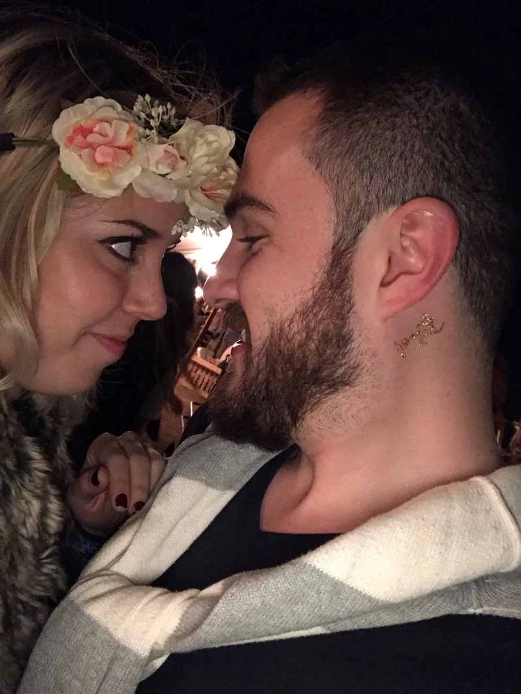

# Alexa & Bruno — Wedding Invite

Static save-the-date site for the wedding on 25 June 2027 in Curaçao.
Live at **https://boda.rivasberaud.com** (hosted on Vercel).

No backend, no build step. Plain HTML + CSS + a little vanilla JS.

---

## Page order

Hero → phrase → intro → date, countdown and calendar → photo collage → Curaçao photo and
destination (light, sand-coloured block) → travel package and agency → RSVP → gifts →
song (send-off) → footer.

## File structure

```
index.html                 ← the site (all markup, styles and scripts)
img/                       ← photos as WebP (hero, 15 collage tiles, Curaçao) and the Spotify code
og.jpg                     ← 1200×630 preview image for WhatsApp / Instagram / iMessage links
favicon-32.png             ← browser tab icon
favicon-192.png            ← Android home-screen icon
apple-touch-icon.png       ← iOS home-screen icon
boda-alexa-bruno.ics       ← "Add to calendar" file for Apple / Outlook
save-the-date/             ← printable Save the Date (only generate_pdf.py is tracked; photos and PDFs stay local)
README.md                  ← this file
```

`files/` and `files.zip` are an earlier single-file snapshot of the invite and are git-ignored.

---

## Deploying

The site is a folder of static files. Deploy the whole folder, not just `index.html`,
because the photos, icons, share image and calendar file live next to it.

- **Vercel (current):** push to `main`; Vercel deploys the folder as-is.
- **Netlify:** drag the folder onto the dashboard.
- **Any web server:** copy the folder into the web root.

The share image and canonical links are absolute (`https://boda.rivasberaud.com/...`).
If the domain ever changes, update the `og:url`, `og:image`, `twitter:image` and
`canonical` tags at the top of `index.html`, plus the URL inside `boda-alexa-bruno.ics`
and the Google Calendar link.

---

## Things to fill in

| What | Where | Status |
|---|---|---|
| **RSVP WhatsApp number** | `index.html`, search `595000000000` (one `wa.me` link with a `TODO` comment above it) | **placeholder — replace with the couple's number** (country code + number, no `+` or spaces) |
| Direct gift-list URLs | `index.html`, search `class="gift-link"` | homepages for now |

> Don't use URL shorteners for the gift links. Earlier `sl1nk.com` / `l1nq.com` codes expired and sent guests to an ad page.

---

## Editing content

All text is plain HTML. Search for the string and edit it.

| What to change | Search for |
|---|---|
| Package price / installments | `data-w="deposit"`, `data-w="installment"`, `data-w="installments"`, `data-w="total"`, `data-w="child"` |
| Agency contact | `data-w="phone"`, `data-w="email"`, `wa.me/595992404780`, `instagram.com/almacendeviajes` |
| Hotel name / link | `data-w="hotel"` and the two buttons under it (map + hotel) |
| Countdown date | `new Date(2027, 5, 25` in the script at the bottom (month is zero-based: 5 = June) |
| Song | `open.spotify.com/track/...` button in the music section; the printed Spotify code in `img/qr-spotify.jpg` must match |
| Calendar event | the Google Calendar `href` under the countdown, and `boda-alexa-bruno.ics` |
| Bank details | `Luna de miel` card; the copy button reads `data-copy="..."` — keep it in sync with the visible number |
| Hero phrase | `Nuestro 25 ayer` |

### Pricing has one source of truth

Every price and contact value in `index.html` is wrapped in an element with a
`data-w="..."` attribute. `save-the-date/generate_pdf.py` reads those attributes
when it runs, so the printable PDF can never drift from the website. Change the
number on the site, then regenerate the PDF:

```bash
pip install reportlab pillow      # once
python3 save-the-date/generate_pdf.py
# writes save-the-date/"Save the date AB 2027.pdf"; set OUTPUT=/some/path.pdf to write elsewhere
```

---

## Photos

Photos live in `img/` as WebP, sized for their tile (800 px on the long side for
single tiles, 1200 px for double-width tiles, 1600 px for the hero). To replace one,
export a WebP at roughly the same size and overwrite the file. `hero.webp` is the top
photo; `curacao.webp` is the island photo above the destination block.

The collage shows 15 of the original 19 photos. Four were dropped for being too dark
or low-resolution (`07`, `12`, `15`, `18` in the original numbering); their originals
are still in git history (`git show 3dc8c47:index.html`) if you ever want them back.

Every tile is sized by the CSS grid (`.mosaic` / `.c2` / `.r2` / `.h3` / `.full`),
never by inline heights. Nudge a crop with an inline `object-position` on the ``.

### Year labels on the collage

Each tile has an empty `data-caption=""`. Put text in it and a small label appears
over the bottom of the photo:

```html
<div class="mi" data-caption="2016 · Primer viaje"></div>
```

Empty captions render nothing, so label only the tiles you want. The photos carry no
date metadata, so the years have to come from you.

### Island photo credit

`img/curacao.webp` is an aerial of a Curaçao resort beach by Bent Van Aeken on
Unsplash (free to use under the Unsplash license, credit appreciated but not
required). Swap it for your own hotel photo whenever you have one: same file name,
about 1800 × 900 px.

---

## Regenerating the share image and icons

`og.jpg` and the favicons were rendered from `img/hero.webp` with Cormorant Garamond
and Cinzel. If the hero photo changes, regenerate them from a new crop (any tool —
1200×630 for `og.jpg`, 180/192/32 px squares for the icons).

---

## Browser support

All modern browsers on desktop and mobile. WebP images require Safari 14+ / iOS 14+
(2020) or any Chrome, Firefox, Edge.

---

*Built with love for Alexa & Bruno · 2026*
